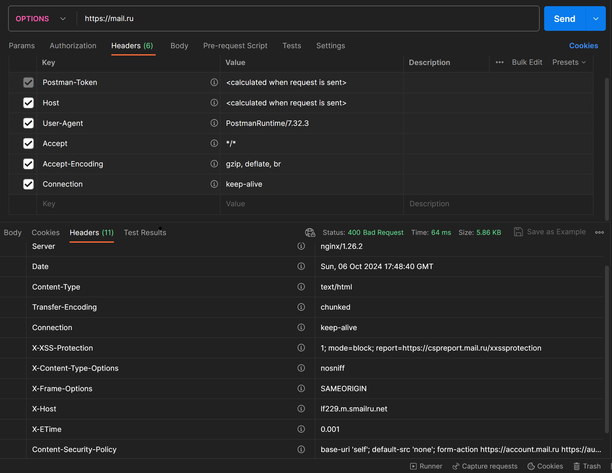
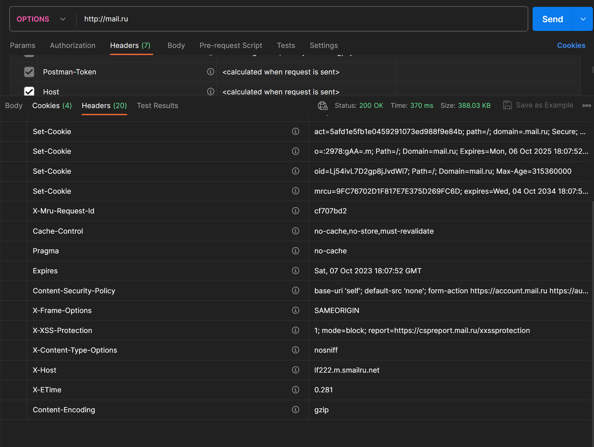

# Лаборраторная работа №1

<h2>Цель лабораторной работы №1</h2>

Цель данной работы – ознакомится с применением протокола HTTP на практике, в реальных системах. Каждый из рассмотренных типов запросов предлагается отправить на несколько известных интернет-сервисов. Впрочем, сервисы указаны лишь как примеры и при желании вы можете выбрать другие (социальные сети, почта, облака, новостные сайты и т.д.).  
С помощью специального ПО (Postman, либо многочисленные аналоги, например, Restlet Clent - расширение для Chrome) вручную отправить следующие запросы и ответить на предлагаемые вопросы.

<h2>Задание</h2>

Необходимо провести ознакомительные работы с протоколом HTTP.

<h3>1.2.1. Ознакомиться с методом OPTIONS.

Данный метод 

1) Отправим запрос на https://mail.ru . 

Ответ:

В данном ответе был получен ответ об ошибке 400 (Bad Request). 

Данная ошибка говорит о том, что сервер не смог обработать данный запрос. Эта ошибка появляется, когда было некорректно указан запрос. 

1.1) Отправим запрос на http://mail.ru

Ответ: 

В данном ответе видно, что если поменять протокол на http, то запрос OPTION будет с кодом 200. Мы так же получим cookies.

