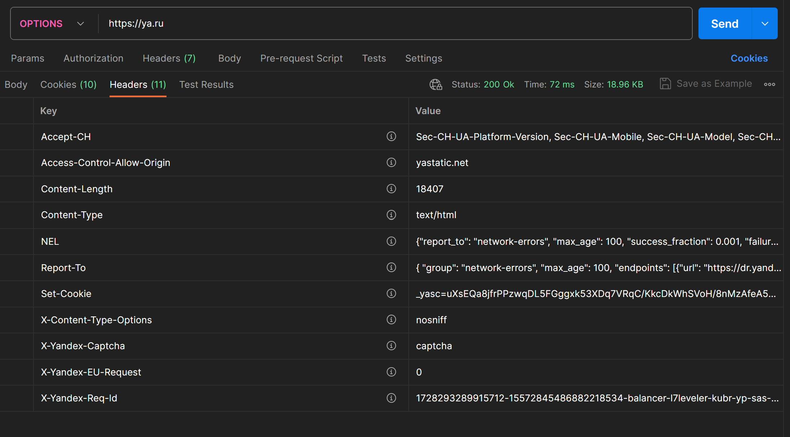
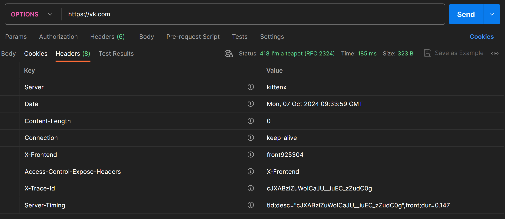
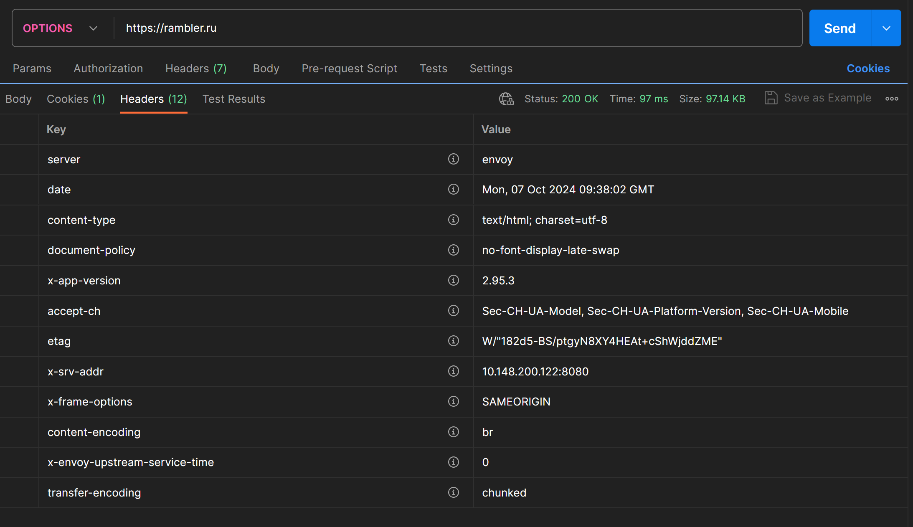
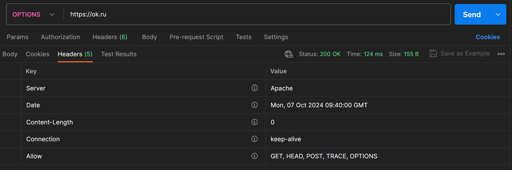

# Лаборраторная работа №1

<h2>Цель лабораторной работы №1</h2>

Цель данной работы – ознакомится с применением протокола HTTP на практике, в реальных системах. Каждый из рассмотренных типов запросов предлагается отправить на несколько известных интернет-сервисов. Впрочем, сервисы указаны лишь как примеры и при желании вы можете выбрать другие (социальные сети, почта, облака, новостные сайты и т.д.).  
С помощью специального ПО (Postman, либо многочисленные аналоги, например, Restlet Clent - расширение для Chrome) вручную отправить следующие запросы и ответить на предлагаемые вопросы.

<h2>Задание</h2>

Необходимо провести ознакомительные работы с протоколом HTTP.

<h3>1.2.1. Ознакомиться с методом OPTIONS</h3>

Данный метод предназначен для получения информации о сервере: проверка работоспособности, тестирования на возможности.

1) Отправим запрос на https://mail.ru . 

Ответ:

В данном ответе был получен ответ об ошибке 400 (Bad Request). 

Данная ошибка говорит о том, что сервер не смог обработать данный запрос. Эта ошибка появляется, когда было некорректно указан запрос. 

2) Оправим запрос на https://ya.ru

Ответ:

В данном запросе ответом была получена 200. 

3) Отправим запрос на https://vk.com

В данном запросе был получен ответ 418.
Данный код ошибки был добавлен первого апреля в 1998 году. Он говорит о том, что сервер не может приготовить кофе, так как он чайник.

4) Отправим запрос на https://rambler.ru

Данный запрос выдал код 200. 

5) Отпрвим запрос на hyyps://ok.ru

Данный запрос выдал код 200, а так же в ответе пы получили корректный ответ на данный метод. 

В haeders Allow были получены методы GET, HEAD, POST, TRACE, OPTIONS.

Для чего используется запрос OPTIONS? Какие коды ответов приходят при этом запросе? Какие сайты правильно обработали запрос и вернули ожидаемые данные?

Данный метод используется для получениия информации о состоянии сервера, а так же его возможностей. 
В данном разделе были получены ответы 200, 400, 418.
<ul>
    <li>200 - код, который говорит о том, что запрос прошел корректно
    <li>400 - код, который говорит о том, что был отправлен некоректный запрос
    <li>418 - код, который говорит о том, сервер отаправил шутку в ответ. В этом ответе нет никакой валидной информации.
</ul>

Из предложенного списка ответов все сайты кроме одного отправили коректный ответ. 

Только https://ok.ru отправил коректный ответ, все остальные серверы отправили некоректный ответ. 

