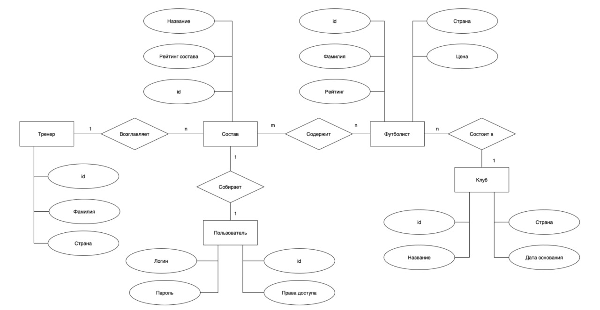

<h1>Лабораторная работа №2</h1>

<h2>Информационной системы для футбольного симулятора "football-menager"</h2>

<h2>1. Краткое описание.</h2>

Система представляет из себя менеджера, который поможет пользователю
футбольного симмулятора иметь возможность получать всю необходимую информацию:
<li> футболисты
<li> футбольные команды
<li> тренерский состав

Данная система подойдет как простое решение для маленьких футбольных лиг. 

<h2>2. Краткое описание предметной области.</h2>

Система "football-menager" выполняет функции менажера, который может помочь пользователю легко оценивать уровень
выбранного футболиста или всей команды. Так же система имеет возможность работать с другими командными видами спорта. 
Хоккей, баскетбол. 

<h2>3. Краткий анализ аналогичных решений.</h2>

| Критерий           | **daocrm**                   | **Системы на основе 1с** | **DaCRM*               |
|--------------------|------------------------------|-------------------------|------------------------|
| Стоимость          | 3000 р/мес                   | 40.000                  | 50.000                 |
| Удобство интерфейса| Интуитивно понятный интерфейс | Переполненный интерфейс | Переполненный интерфейс |
| Функциональность   | Работа с работником          | Есть много функционала  | Есть много функционала |

<h2>4. Функциональные требования.</h2>
В данном приложении реализованно 2 роли:
- Тренер
    - Добавление нового футболиста
    - Удаление футболиста
    - Переход в другой клуб
    - Получить рейтинг по клубу
- Футболист
    - Просмотр своих данных/статистики
    - Изменение своих личных данных
  

**Общий endpoint - Авторизация**
<h2>5. Use-Case - диаграмма.</h2>

<h2>6. ER - диаграмма</h2>

<h2>7. Пользовательский сценарий</h2>

1) Тренер приходит в клуб, который используют данную систему.
    * Тренер авторизируется на сайте. 
    * Запрашивает информацию о футболистах.
    * Запрашивает информацию о клубе.

2) Футболист хочет сравнить команду, с которой он будет играть завтра
    * Футболист авторизируется на сайте
    * Запрашивает рейтинг клуба, против которого он будет играть завтра.

3) Тренер позвал нового игрока в свой клуб.
    * Тренер авторизируется на сайте.
    * Футболист региститруется на сайте, передает свой код регистрации тренеру.
    * Тренер добавляет нового игрока, передавая код регистрации.

_код регистрации - это токен, который позволяет авторизировать футболиста и добавить его в клуб. Не бесконечный._

