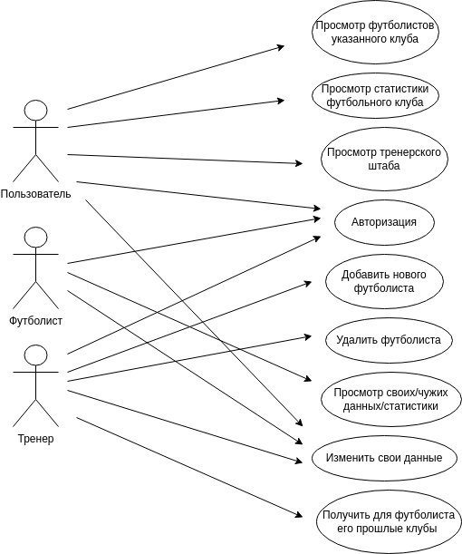

<h1>Лабораторная работа №2</h1>

<h2>Информационной системы для футбольного симулятора "football-menager"</h2>

<h2>1. Краткое описание.</h2>

Система представляет из себя менеджера, который поможет пользователю
футбольного симмулятора иметь возможность получать всю необходимую информацию:
<li> футболисты
<li> футбольные оманды
<li> тренерский состав

<h2>2. Краткое описание предметной области.</h2>

Система "football-menager" выполняет функции менажера, который может помочь пользователю легко оценивать уровень
выбранного футболиста или всей команды. Так же система имеет возможность работать с другими командными видами спорта. 
Хоккей, баскетбол. 

<h2>3. Краткий анализ аналогичных решений.</h2>

| Критерий           | **daocrm**                   | **Системы на основе 1с** | **DaCRM*               |
|--------------------|------------------------------|-------------------------|------------------------|
| Стоимость          | 3000 р/мес                   | 40.000                  | 50.000                 |
| Удобство интерфейса| Интуитивно понятный интерфейс | Переполненный интерфейс | Переполненный интерфейс |
| Функциональность   | Работа с работником          | Есть много функционала  | Есть много функционала |

<h2>4. Функциональные требования.</h2>
В данном приложении реализованно 3 роли:
- Пользователь
    - Просмотр футболистов указанного клуба
    - Просмотр статистики футбольного клуба
    - Просмотр тренерского штата.
- Тренер
    - Добавление нового футболиста
    - Удаление футболиста
    - Просмотр составов
- Футболист
    - Просмотр своих данных/статистики
    - Изменение своих личных данных
    - Получить тренерский состав
    - Получить список прошлых команд
  

**Общий endpoint - Авторизация**
<h2>5. Use-Case - диаграмма.</h2>

